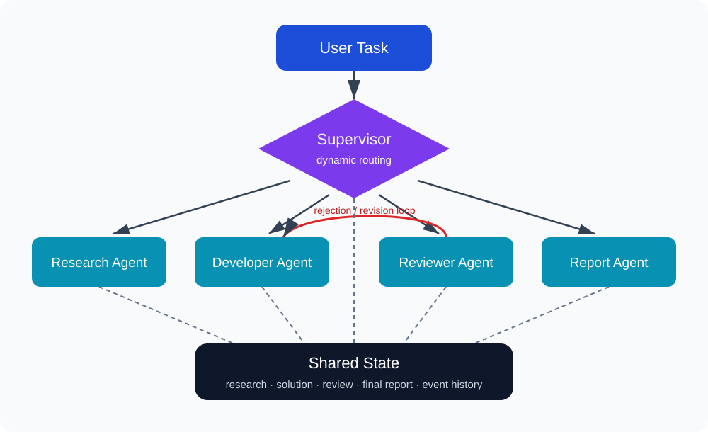
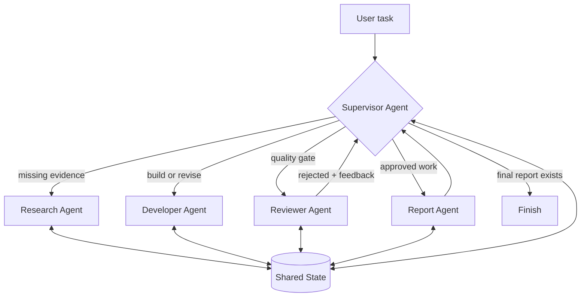

# Gemini Multi-Agent Team

A complete multi-agent system in which a **Supervisor Agent dynamically chooses** the next specialist. Research, implementation, review, revision, and reporting are coordinated through one validated shared state. The default model is Google's `gemini-3.5-flash-lite`.

## Requirements coverage

| Requirement | Implementation |
|---|---|
| Supervisor Agent | `SupervisorAgent.route()` asks Gemini for one structured routing decision per loop |
| Research Agent | Produces a research brief and stores it in `state.research` |
| Developer Agent | Reads research/review and writes or revises `state.solution` |
| Reviewer Agent | Approves or returns feedback; rejection routes back to development |
| Report Agent | Runs only after approval and synthesizes all prior artifacts |
| Dynamic execution | The supervisor evaluates current state every iteration; no loop calls all agents in order |
| Shared state | Pydantic `SharedState`, persisted as `run_output/state.json` |
| Observable communication | Console events plus `execution_trace.md` show every decision and handoff |

## Architecture





The supervisor does not call a hard-coded pipeline. At each iteration it receives the entire current state and returns a schema-validated choice: `research`, `developer`, `reviewer`, `report`, or `finish`. Guardrails prevent reporting before approval or finishing without a report. A failed review remains in shared state, which lets the supervisor send the work back to the Developer.

## Setup

Requires Python 3.11+.

```bash
python -m venv .venv
# Windows PowerShell
.venv\Scripts\Activate.ps1
pip install -e ".[dev]"
```

Open the ignored `.env` file and replace the placeholder:

```dotenv
GOOGLE_API_KEY=your_real_key_here
GEMINI_MODEL=gemini-3.5-flash-lite
```

Never commit `.env`. Only `.env.example` belongs in GitHub.

## Run

Real Gemini execution:

```bash
multi-agent "Design a verified disaster-response communication plan for a college campus"
```

API-key-free demonstration (same orchestration, deterministic model responses):

```bash
multi-agent --demo "Create a practical plan to reduce food waste in a university cafeteria"
```

Alternative without installing the console command:

```bash
python -m multi_agent_team.cli --demo "Your larger task"
```

The terminal shows live routing. The `run_output/` directory receives:

- `state.json`: complete shared memory and event history
- `execution_trace.md`: readable agent-to-agent routing trace
- `final_report.md`: final approved deliverable

Run tests with `python -m unittest discover -s tests -v` (or `pytest`). The tests prove the normal route, a reviewer rejection/revision route, and safety guardrails.

## Project structure

```text
multi_agent_team/
  agents.py       # four specialist agent definitions
  supervisor.py   # dynamic router and safety gates
  workflow.py     # event loop and shared-state updates
  models.py       # typed state and structured outputs
  llm.py          # Gemini and offline demo providers
  cli.py          # runnable terminal demonstration
docs/
  architecture.svg
  VIDEO_SCRIPT.md
tests/
```

## Submission checklist

1. Create a public GitHub repository and push this folder (confirm `.env` is absent).
2. Submit the exact folder URL, e.g. `https://github.com/USERNAME/REPO/tree/main/FOLDER`.
3. Record the walkthrough using [the video script](docs/VIDEO_SCRIPT.md).
4. Upload as Public or Unlisted to YouTube and submit the URL.

Model documentation: [Gemini 3.5 Flash-Lite](https://ai.google.dev/gemini-api/docs/models/gemini-3.5-flash-lite) and [Google Gen AI Python SDK](https://ai.google.dev/gemini-api/docs/quickstart).
