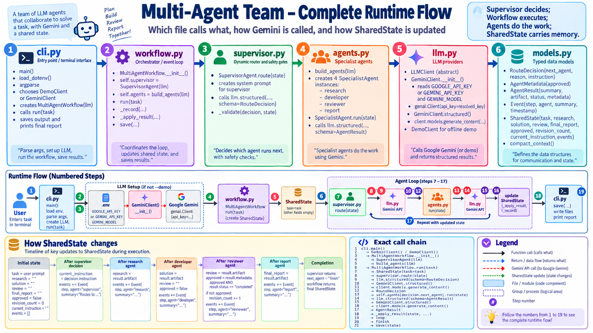

# Documentation and visual assets

This directory contains the diagrams and walkthrough material for the Gemini
Multi-Agent Team application. Image paths are relative, so they render both in
this document and from the repository's root README.

## Complete runtime flow



**File:** [`app_flow.png`](app_flow.png)<br>
**Root README reference:** `docs/app_flow.png`

This detailed illustration maps the runtime from `cli.py` through
`workflow.py`, `supervisor.py`, `agents.py`, `llm.py`, and `models.py`. It also
shows the numbered call chain and how `SharedState` changes after each agent.

Use this image when explaining implementation details or demonstrating how
files call one another. It is a project documentation asset and does not come
from an external image provider.

## Architecture overview


**File:** [`architecture.svg`](architecture.svg)<br>
**Root README reference:** `docs/architecture.svg`

This compact diagram shows the Supervisor dynamically routing work among the
four specialists through one shared state, including the review/revision loop.
Use it for a quick conceptual overview before presenting the detailed runtime
flow. It is a project documentation asset and does not come from an external
image provider.

## Walkthrough material

[`VIDEO_SCRIPT.md`](VIDEO_SCRIPT.md) provides a suggested five-to-seven-minute
demonstration covering the architecture, relevant source files, CLI or
Streamlit execution, generated artifacts, and the tested revision loop.

## Referencing these images

From the repository root `README.md`:

```markdown


```

From a Markdown file inside `docs/`:

```markdown


```
